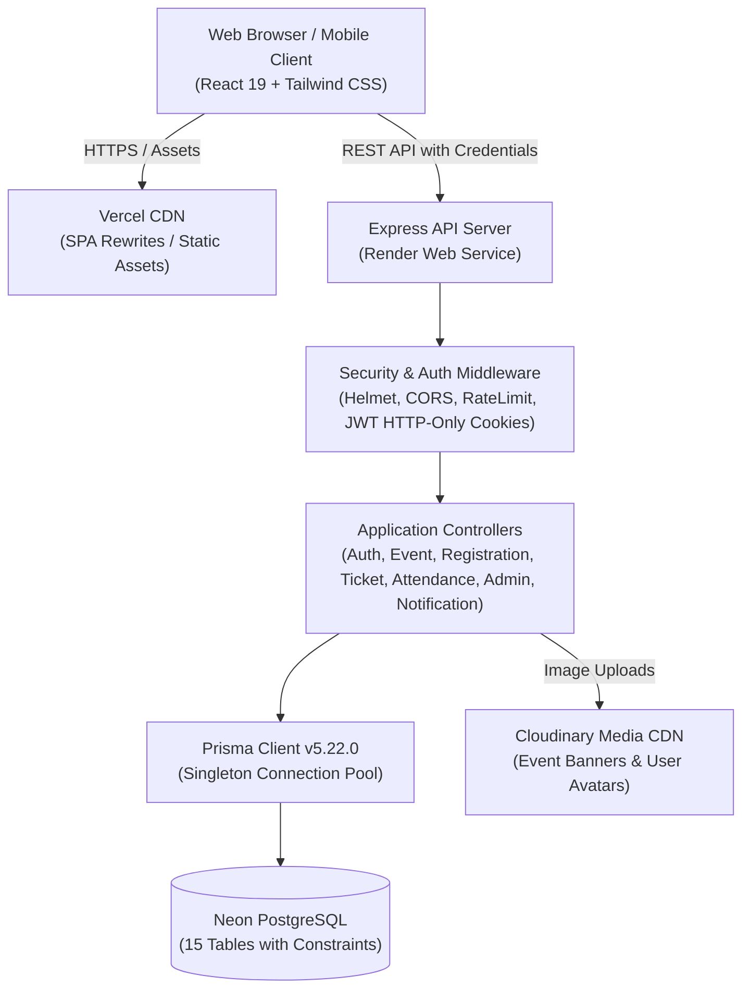
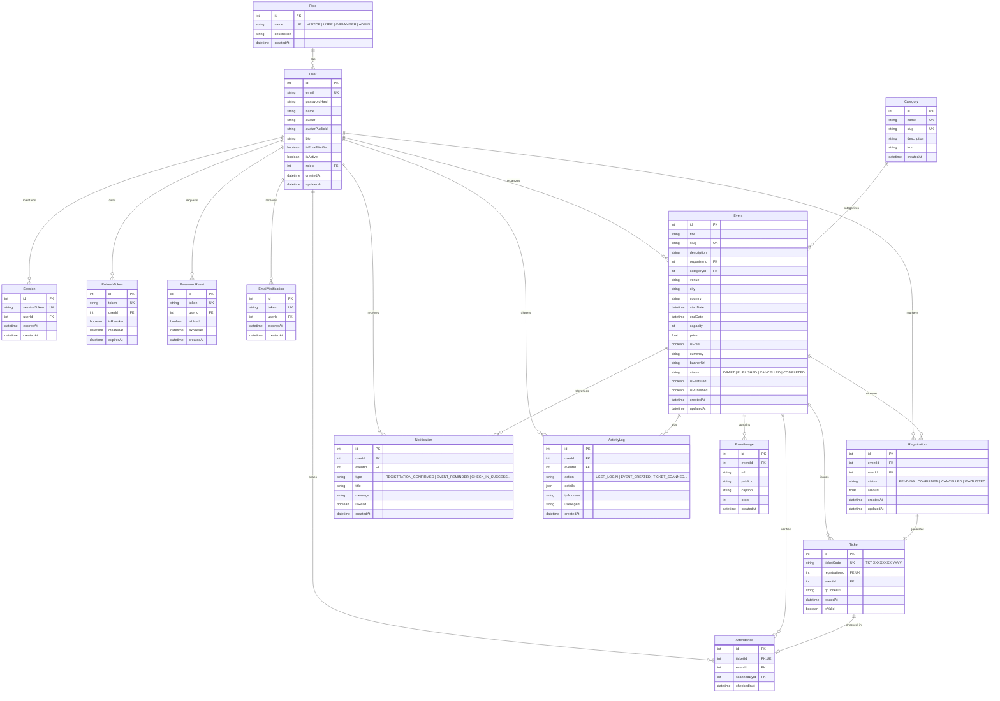

# EventHub — Enterprise Full-Stack Event Management & Admission Platform

[](https://nodejs.org/)
[](https://react.dev/)
[](https://www.prisma.io/)
[](https://neon.tech/)
[](LICENSE)

EventHub is a modern, enterprise-grade full-stack event discovery, registration, and attendance tracking platform. Built with high-concurrency database transactions, strict role-based access control (RBAC), cryptographic QR-code digital admissions, real-time venue scanning with camera support, live platform analytics, and a responsive glassmorphic user interface.

---

## Table of Contents
1. [Core Features](#core-features)
2. [Technology Stack](#technology-stack)
3. [Architecture Overview](#architecture-overview)
4. [Database Entity Relationship (ER) Diagram](#database-entity-relationship-er-diagram)
5. [Role-Based Access Control (RBAC) Matrix](#role-based-access-control-rbac-matrix)
6. [Pre-Seeded Demo Credentials](#pre-seeded-demo-credentials)
7. [API Specification & Endpoints](#api-specification--endpoints)
8. [Local Installation & Setup Guide](#local-installation--setup-guide)
9. [Production Deployment Guide](#production-deployment-guide)
10. [Security & Robustness Implementation](#security--robustness-implementation)
11. [5–10 Minute Demo Video Walkthrough Guide](#510-minute-demo-video-walkthrough-guide)

---

## Core Features

### 1. Discovery & Catalog
- **Multi-Parameter Search & Filtering:** Case-insensitive search on title/description/city, dynamic category filtering, price filtering (free vs. paid), date sorting, and paginated results.
- **Rich Event Pages:** High-resolution banner displays, organizer bios, venue location mapping, countdown schedules, real-time capacity fill meters, and remaining spot counters.

### 2. Atomic Registration & Cryptographic QR Tickets
- **Concurrency-Safe Capacity Enforcement:** Database transaction guarantees capacity limits are never breached under simultaneous registrations.
- **Duplicate Prevention:** Unique database constraints ensure attendees cannot register multiple times for the same event (`@@unique([eventId, userId])`).
- **Unpredictable Ticket Codes:** Format `TKT-XXXXXXXX-YYYY` tied to high-resolution PNG QR codes (base64 data URI).
- **Pass Management:** Attendees can view passes in a digital modal or under their "My Tickets" portal, with cancellation controls.

### 3. Venue Check-in & QR Camera Scanner
- **Live Camera Scanner:** Built with `html5-qrcode` to scan digital tickets directly through laptop webcams or mobile cameras.
- **Manual Verification Fallback:** Organizers can type or paste ticket codes to check in guests manually.
- **Duplicate Scan Detection:** Rejects already-scanned tickets with `409 Conflict` and displays the exact prior check-in timestamp and staff member.
- **Audio Feedback:** Browser Web Audio API triggers a high-pitched success chime for valid admissions and a low buzz for duplicate/invalid tickets.

### 4. Dashboards & In-App Notifications
- **Organizer Dashboard:** Turnout rates, attendee counts, capacity utilization bars, and an interactive **Attendee Roster Modal** with manual check-in triggers.
- **Admin Platform Console:** System-wide KPI telemetry (total users, events, registrations, revenue, turnout %), visual breakdowns for roles, event statuses, category distributions, searchable user management table with instant account activation/deactivation toggles, and live platform audit logs.
- **In-App Notification Bell:** Navbar dropdown with animated unread badge counter, auto-polling, single/all read triggers, and alert classifications.

---

## Technology Stack

| Layer | Technologies |
|---|---|
| **Frontend** | React 19, Vite v8, Tailwind CSS v3, React Router DOM v7, TanStack Query v5, Axios, Lucide React, `html5-qrcode` |
| **Backend** | Node.js, Express.js (v5), Prisma ORM (v5.22.0), Helmet, CORS, Express-Rate-Limit, Cookie-Parser, Zod, bcryptjs, jsonwebtoken, qrcode, Multer |
| **Database** | Serverless PostgreSQL via Neon (`neondb`) |
| **Media CDN** | Cloudinary (with local fallback memory controller) |
| **Deployment** | Vercel (Frontend SPA) + Render (Backend Web Service) |

---

## Architecture Overview



---

## Database Entity Relationship (ER) Diagram

The database schema consists of **15 specialized models** built to production relational standards:



---

## Role-Based Access Control (RBAC) Matrix

| Feature / Resource | Visitor (Public) | User (Attendee) | Organizer | Administrator |
|---|:---:|:---:|:---:|:---:|
| Browse Events & Search | ✅ | ✅ | ✅ | ✅ |
| View Event Details | ✅ | ✅ | ✅ | ✅ |
| Register Account / Login | ✅ | ✅ | ✅ | ✅ |
| 1-Click Register for Events | ❌ | ✅ | ✅ | ✅ |
| Access Digital QR Tickets | ❌ | ✅ (Own) | ✅ (Own) | ✅ (All) |
| Cancel Ticket Booking | ❌ | ✅ (Own) | ✅ (Own) | ✅ (All) |
| In-App Notifications | ❌ | ✅ | ✅ | ✅ |
| Create & Edit Events | ❌ | ❌ | ✅ (Own) | ✅ (All) |
| Upload Event Banners | ❌ | ❌ | ✅ | ✅ |
| Organizer Dashboard & Turnout | ❌ | ❌ | ✅ (Own events) | ✅ (All events) |
| View Attendee Roster | ❌ | ❌ | ✅ (Own events) | ✅ (All events) |
| Venue QR Scanner / Check-in | ❌ | ❌ | ✅ (Own events) | ✅ (All events) |
| Admin Platform Analytics | ❌ | ❌ | ❌ | ✅ |
| Manage Users (Activate/Deactivate) | ❌ | ❌ | ❌ | ✅ |
| View System Activity Logs | ❌ | ❌ | ❌ | ✅ |

---

## Pre-Seeded Demo Credentials

The platform is pre-seeded with test accounts across all roles. The frontend login page also features **1-click instant login buttons** for evaluators:

| Role | Email Address | Password | Privileges |
|---|---|---|---|
| **Administrator** | `admin@eventhub.com` | `Admin@123` | Full root control, platform analytics, user toggles |
| **Organizer** | `organizer@eventhub.com` | `Organizer@123` | Create events, view rosters, venue QR scanner |
| **Standard User** | `user@eventhub.com` | `User@123` | Event registration, QR ticket pass, notifications |

---

## API Specification & Endpoints

Base URL: `http://localhost:5000/api` (or deployed Render URL).

### 1. Authentication (`/api/auth`)
- `POST /register` — Register a new account (`name`, `email`, `password`, `role`). Returns user & sets HTTP-only cookies.
- `POST /login` — Authenticate user. Returns access token & sets HTTP-only refresh cookie.
- `POST /logout` — Revokes session and clears authentication cookies.
- `GET /me` — Returns the authenticated user session profile.
- `POST /refresh` — Rotates access token using HTTP-only refresh token.
- `POST /forgot-password` — Generates a secure password reset token.
- `POST /reset-password` — Validates token and resets account password.

### 2. Events (`/api/events`)
- `GET /` — Search and filter events with query parameters:
  - `search` (keyword)
  - `category` (slug or id)
  - `city` (exact city filter)
  - `isFree` (`true` or `false`)
  - `sortBy` (`date_asc`, `date_desc`, `price_asc`, `price_desc`)
  - `page` & `limit` (pagination)
- `GET /featured` — Top featured published events.
- `GET /:slugOrId` — Complete event details including organizer bio and capacity status.
- `GET /organizer/my-events` — Protected (`ORGANIZER`, `ADMIN`). Retrieves all events hosted by current user with registration counts.
- `POST /` — Protected (`ORGANIZER`, `ADMIN`). Create new event.
- `PUT /:id` — Protected (`ORGANIZER` owner, `ADMIN`). Update event.
- `DELETE /:id` — Protected (`ORGANIZER` owner, `ADMIN`). Soft/hard delete event.

### 3. Categories (`/api/categories`)
- `GET /` — Returns all 8 event categories with event count aggregations.

### 4. Registrations & Tickets (`/api/registrations`, `/api/tickets`)
- `POST /registrations/:eventId` — Protected (`USER`, `ORGANIZER`, `ADMIN`). Atomic event registration with capacity and duplicate check.
- `GET /registrations/my-registrations` — Protected. Attendee's registered tickets and pass history.
- `DELETE /registrations/:id` — Protected. Cancel ticket registration.
- `GET /registrations/event/:eventId/attendees` — Protected (`ORGANIZER` owner, `ADMIN`). Full attendee roster with check-in status.
- `GET /tickets/my-tickets` — Protected. List issued tickets with high-res base64 QR codes.
- `GET /tickets/code/:ticketCode` — Public/Protected ticket verification lookup.

### 5. Attendance & QR Check-in (`/api/attendance`)
- `POST /check-in` — Protected (`ORGANIZER`, `ADMIN`). Scans or verifies ticket code:
  - Valid: Returns `200 OK`, marks ticket checked in, creates `Attendance` record, emits notification.
  - Already scanned: Returns `409 Conflict` with prior timestamp and staff identity.
  - Invalid: Returns `404 Not Found`.
- `GET /event/:eventId` — Protected. Event turnout summary (total registered, checked-in count, turnout percentage).

### 6. Notifications (`/api/notifications`)
- `GET /` — Protected. List recent 30 notifications + unread count.
- `PATCH /read-all` — Protected. Mark all notifications as read.
- `PATCH /:id/read` — Protected. Mark specific notification as read.
- `DELETE /:id` — Protected. Remove notification.

### 7. Administration (`/api/admin`)
- `GET /stats` — Protected (`ADMIN`). Global platform KPIs (users, events, registrations, revenue, turnout %, role breakdowns, category distributions, recent activity).
- `GET /users` — Protected (`ADMIN`). All registered users with event/registration counts and active flags.
- `PATCH /users/:id/toggle-status` — Protected (`ADMIN`). Toggle user account active status.

### 8. Uploads (`/api/upload`)
- `POST /image` — Protected (`ORGANIZER`, `ADMIN`). Upload event banner image to Cloudinary (with local fallback).
- `DELETE /image` — Protected (`ORGANIZER`, `ADMIN`). Delete image by `publicId`.

---

## Local Installation & Setup Guide

### Prerequisites
- **Node.js** >= 20.0.0
- **npm** >= 10.0.0
- **Git**
- A Neon PostgreSQL connection string (or local PostgreSQL)

### 1. Clone the Repository
```bash
git clone https://github.com/<your-username>/eventhub.git
cd eventhub
```

### 2. Configure Backend
```bash
cd backend
npm install
```

Create `backend/.env` file:
```env
PORT=5000
NODE_ENV=development
DATABASE_URL="postgresql://<user>:<password>@<neon-host>/neondb?sslmode=require"
JWT_ACCESS_SECRET="generate_a_random_64_char_hex_secret"
JWT_REFRESH_SECRET="generate_another_random_64_char_hex_secret"
JWT_ACCESS_EXPIRY=15m
JWT_REFRESH_EXPIRY=7d
FRONTEND_URL="http://localhost:5173"
COOKIE_DOMAIN="localhost"
```

Sync schema and seed initial database:
```bash
npx prisma generate
npx prisma db push
npm run db:seed
```

Start the backend API server:
```bash
npm run dev
# Running on http://localhost:5000 (Health check: http://localhost:5000/health)
```

### 3. Configure Frontend
Open a second terminal window:
```bash
cd ../frontend
npm install
```

Create `frontend/.env` file (optional for dev, Vite proxies `/api` to port 5000 by default):
```env
VITE_API_URL=/api
```

Start the Vite dev server:
```bash
npm run dev
# Running on http://localhost:5173
```

---

## Production Deployment Guide

### Deploy Backend on Render
1. Create a **New Web Service** on Render and connect your GitHub repository.
2. Set the following build and run options:
   - **Root Directory:** `backend`
   - **Environment:** `Node`
   - **Build Command:** `npm install && npm run render-build`
   - **Start Command:** `npm start`
3. Add Environment Variables:
   - `NODE_ENV`: `production`
   - `PORT`: `5000`
   - `DATABASE_URL`: Your Neon PostgreSQL direct connection string.
   - `JWT_ACCESS_SECRET` & `JWT_REFRESH_SECRET`: Secure cryptographic strings.
   - `FRONTEND_URL`: Your Vercel frontend URL (e.g. `https://eventhub.vercel.app`).
   - `CLOUDINARY_*`: Cloudinary credentials for banner storage.

*(Alternatively, use the included root `render.yaml` Blueprint specification for 1-click deployment).*

### Deploy Frontend on Vercel
1. Import the repository into Vercel.
2. Select `frontend` as the **Root Directory**.
3. Framework Preset: **Vite**.
4. Set Environment Variable:
   - `VITE_API_URL`: Your Render backend API endpoint (e.g., `https://eventhub-api.onrender.com/api`).
5. Deploy. The included `frontend/vercel.json` ensures that all SPA routes (`/events`, `/dashboard/*`, `/scanner`, `/my-tickets`) work seamlessly without 404 errors.

---

## Security & Robustness Implementation

1. **Password Security:** Passwords hashed with `bcryptjs` using 12 salt rounds.
2. **Session & Token Architecture:** Short-lived 15-minute JWT access tokens paired with 7-day refresh tokens stored in `httpOnly`, `sameSite: 'lax'`, `secure` cookies to eliminate XSS token theft.
3. **Database Concurrency & Integrity:** All registrations run inside Prisma interactive transactions (`prisma.$transaction`) with capacity check guards and composite database unique constraints (`@@unique([eventId, userId])`).
4. **Injection Protection:** SQL injection prevented via Prisma parameterized queries and ORM query builders.
5. **Rate Limiting:** Global rate limiting (200 requests/15m) plus a stricter auth endpoint limiter (20 requests/15m) to defend against credential stuffing and brute force attacks.
6. **Input Validation:** Backend endpoints strictly validate JSON input using `Zod` schemas before touching database logic.
7. **Reverse Proxy Compliance:** Express configured with `app.set('trust proxy', 1)` to preserve accurate client IPs across cloud reverse proxies (Render, AWS, Cloudflare).

---

## 5–10 Minute Demo Video Walkthrough Guide

Use this script and sequence to record a presentation video for evaluators:

### 1. Introduction (0:00 – 1:00)
- State your name, the project name (**EventHub**), and target problem statement.
- Highlight the architecture: React 19 + Vite, Tailwind CSS, Node.js/Express, Prisma ORM, Neon PostgreSQL (all 15 models live), and Cloudinary.

### 2. Event Discovery & User Flow (1:00 – 3:00)
- Showcase the **Home Page**: glassmorphic navigation, category cards, featured events.
- Toggle **Dark Mode / Light Mode** smoothly.
- Navigate to `/events`: demonstrate live search debounce, category pill filtering, city dropdown, and price filters.
- Open an event detail page: show banner, venue info, and capacity meter.
- Use 1-Click login as **Standard User** (`user@eventhub.com`).
- Click **"Register for Free"**: show immediate confirmation and auto-generated digital ticket with base64 QR code.
- Navigate to **"My Tickets"**: display digital admission pass with cryptographic code (`TKT-XXXXXXXX-YYYY`).

### 3. Organizer Portal & QR Check-in (3:00 – 5:30)
- Log out and 1-Click login as **Organizer** (`organizer@eventhub.com`).
- Navigate to **Organizer Dashboard** (`/dashboard/organizer`):
  - Point out KPI cards (hosted events, attendee count, checked-in count, turnout rate).
  - Inspect capacity progress meters.
  - Open the **Attendee Roster Modal**: search attendees, review check-in status.
- Navigate to **Venue QR Scanner** (`/scanner`):
  - Start camera or test manual code input with the ticket code from the previous step.
  - Submit check-in: highlight the emerald success card, attendee details, and audio chime.
  - Submit the **same ticket code a second time**: highlight the amber `409 Conflict` duplicate alert showing the exact prior check-in time and staff identifier.

### 4. Admin Dashboard & Platform Telemetry (5:30 – 7:30)
- Log out and 1-Click login as **Administrator** (`admin@eventhub.com`).
- Navigate to **Admin Dashboard** (`/dashboard/admin`):
  - Review platform KPIs (total users, total events, total registrations, overall turnout rate).
  - Walk through visual breakdown cards (Events by Status, Top Categories, Users by Role).
  - Audit the **User Management Table**: demonstrate toggling an account status between **Active** and **Deactivated** with instant toast feedback.
  - Review the **Live Activity Audit Feed** showing real-time timestamps of logins, registrations, and ticket scans.

### 5. Architecture, Database & Conclusion (7:30 – 8:30)
- Briefly display the **ER Diagram** showing the 15 database tables.
- Mention security hardening (Helmet, rate limits, HTTP-only cookies, Zod validation, atomic capacity transactions).
- Conclude the presentation.
